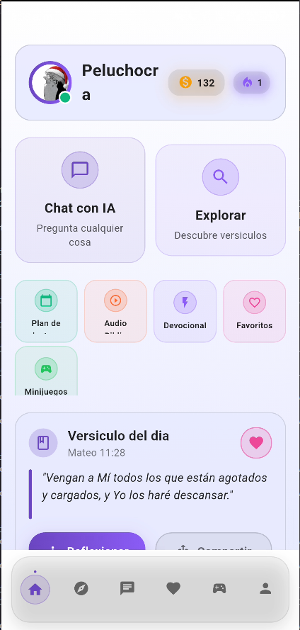
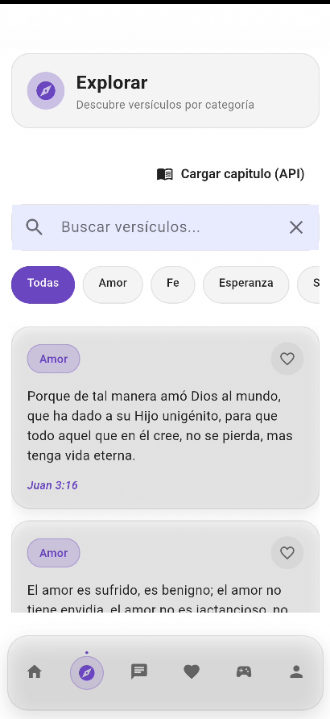
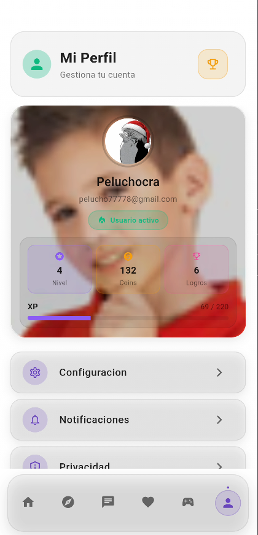

# M.A.I.K.A

> Una app movil para acompanar a jovenes, lideres y ministerios con contenido biblico interactivo, chat, devocionales, lectura y minijuegos.

[](#)
[](#)
[](#)
[](https://github.com/joshuaMBux/M.A.I.K.A_estable/releases/latest)


**M.A.I.K.A** significa **Modelo Artificial Inteligente Keeper Asistente**.

M.A.I.K.A fue pensada para acercar la Biblia al dia a dia de los jovenes con una experiencia mas visual, mas cercana y mas interactiva. La app combina lectura, acompanamiento, conversacion, juegos y contenido espiritual en un solo lugar.

## Pensada Para

- iglesias que quieren usar tecnologia en sus cultos juveniles
- lideres que buscan una herramienta de apoyo para discipulado
- jovenes que quieren explorar la Biblia de una forma mas dinamica
- ministerios que desean ofrecer contenido biblico accesible desde el celular

## Que Puede Hacer M.A.I.K.A

- conversar con el usuario sobre temas biblicos y espirituales
- mostrar un avatar emocional que responde segun el contexto
- ofrecer devocionales y planes de lectura
- guardar versiculos y conversaciones importantes
- explorar versiculos por categoria
- reproducir contenido de audio
- incluir minijuegos y gamificacion para reforzar aprendizaje

## Por Que Usarla En Jovenes

- convierte el contenido biblico en una experiencia mas atractiva
- ayuda a mantener el interes durante la semana, no solo en el culto
- puede complementar dinamicas, estudios y actividades juveniles
- une lectura, interaccion y motivacion en una sola app

## Asi Se Ve La App

| Inicio | Chat | Explorar |
|---|---|---|
|  |  |  |

| Avatar | Avatar Overclock | Perfil |
|---|---|---|
|  |  |  |

| Juegos | Biblia Fragmentada |
|---|---|
|  |  |

## Descargar La App

La forma recomendada de descargar M.A.I.K.A es desde `Releases`:

[Descargar ultima version](https://github.com/joshuaMBux/M.A.I.K.A_estable/releases/latest)

Archivo publicado:

```text
app-release.apk
```

## Lo Mas Destacado

### Chat con Maika

Un espacio de conversacion biblica con respuestas orientadas a acompanamiento, reflexion y exploracion espiritual.

### Avatar emocional

La app incluye un avatar que cambia de expresion segun el contexto del mensaje, haciendo la interaccion mas cercana y memorable.

### Planes y devocionales

Ideal para crear habitos de lectura y reflexion en jovenes, grupos pequenos y ministerios.

### Juegos y dinamicas

Incluye minijuegos y elementos de gamificacion para reforzar contenido biblico de forma mas participativa.

## Uso Sugerido En Iglesia

M.A.I.K.A puede usarse como apoyo en:

- cultos de jovenes
- clases biblicas
- dinamicas de grupos pequenos
- retos semanales de lectura
- actividades de seguimiento y discipulado

## Informacion Para Desarrolladores

Este repositorio corresponde a la app principal en Flutter. Los proyectos auxiliares como `Maika_beta_1` y `maika_avatar` no forman parte del APK principal publicado desde este repo.

### Ejecutar en desarrollo

```powershell
flutter pub get
flutter run
```

### Flujo rapido para dev

```powershell
flutter pub get
flutter analyze
flutter test
flutter run
```

### Puntos de entrada utiles

- `lib/main.dart`: arranque de la app y providers globales
- `lib/presentation/pages/main/main_app.dart`: navegacion principal
- `lib/core/di/injection_container.dart`: dependencias y servicios
- `lib/core/theme/`: tema, color scheme y extensiones visuales

### Donde tocar cada modulo

- chat y avatar: `lib/presentation/pages/chat/`
- explorar versiculos: `lib/presentation/pages/explore/`
- favoritos: `lib/presentation/pages/favorites/`
- devocionales: `lib/presentation/pages/devotional/`
- plan de lectura: `lib/presentation/pages/reading_plan/`
- juegos: `lib/presentation/pages/games/` y `lib/presentation/games/maika_fragmentada/`
- perfil y ajustes: `lib/presentation/pages/profile/`

### Comandos utiles

```powershell
flutter pub get
flutter analyze
flutter test
flutter build apk --debug
flutter build apk --release
```

### APK release

```powershell
flutter clean
flutter pub get
flutter build apk --release
```

Salida esperada:

```text
build/app/outputs/flutter-apk/app-release.apk
```

### Requisitos

- Flutter 3.x
- Dart 3.x
- Android Studio o Android SDK
- Java 17

### Estructura principal

```text
lib/
  core/           configuracion, servicios, tema y utilidades
  data/           modelos, repositorios y data sources
  domain/         entidades y casos de uso
  presentation/   UI, blocs, widgets, juegos y pantallas
  main.dart       punto de entrada
```

### Servicios externos

Algunas funciones avanzadas dependen de servicios externos:

- Rasa: `lib/core/constants/rasa_config.dart`
- Overclock backend: `lib/core/constants/openrouter_backend_config.dart`

## Estado Del Proyecto

Proyecto orientado a prototipado funcional, uso academico y evolucion de producto.

## Licencia

Proyecto de uso educativo y de investigacion.
